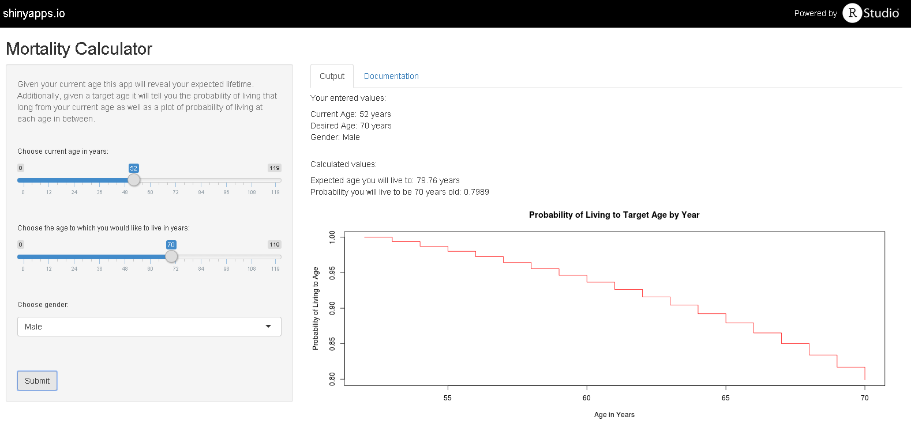
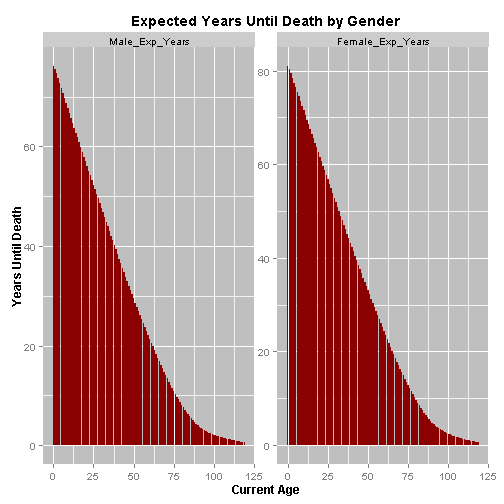
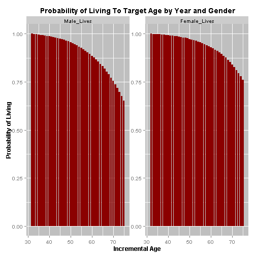

### The Mortality Calculator Shiny Application

    

[*Mortality Calculator*](https://sobolev.shinyapps.io/Data_Products_Course_Project)

--- #id 

### Based On Social Security Administration 2010 Life Table

<table>
 <thead>
  <tr>
   <th style="text-align:right;"> Age </th>
   <th style="text-align:right;"> Male_Prob_Death </th>
   <th style="text-align:right;"> Male_Lives </th>
   <th style="text-align:right;"> Male_Exp_Years </th>
  </tr>
 </thead>
<tbody>
  <tr>
   <td style="text-align:right;"> 0 </td>
   <td style="text-align:right;"> 0.006680 </td>
   <td style="text-align:right;"> 100000 </td>
   <td style="text-align:right;"> 76.10 </td>
  </tr>
  <tr>
   <td style="text-align:right;"> 1 </td>
   <td style="text-align:right;"> 0.000436 </td>
   <td style="text-align:right;"> 99332 </td>
   <td style="text-align:right;"> 75.62 </td>
  </tr>
  <tr>
   <td style="text-align:right;"> 2 </td>
   <td style="text-align:right;"> 0.000304 </td>
   <td style="text-align:right;"> 99289 </td>
   <td style="text-align:right;"> 74.65 </td>
  </tr>
  <tr>
   <td style="text-align:right;"> 3 </td>
   <td style="text-align:right;"> 0.000232 </td>
   <td style="text-align:right;"> 99259 </td>
   <td style="text-align:right;"> 73.67 </td>
  </tr>
  <tr>
   <td style="text-align:right;"> 4 </td>
   <td style="text-align:right;"> 0.000172 </td>
   <td style="text-align:right;"> 99235 </td>
   <td style="text-align:right;"> 72.69 </td>
  </tr>
  <tr>
   <td style="text-align:right;"> 5 </td>
   <td style="text-align:right;"> 0.000155 </td>
   <td style="text-align:right;"> 99218 </td>
   <td style="text-align:right;"> 71.70 </td>
  </tr>
</tbody>
</table>

- The most current table
- Different mortality expectation by gender

---

### Calculates Expected Lifetime Given Current Age and Gender

 

---

### Calculates Probability of Living to Target Age Given Current Age and Gender

 

---

### Advantages of Application

1. Easy to use
2. Only needs three inputs
3. Interactive so user can investigate multiple scenarios
4. Based on most current mortality data available
5. Distinguishes results by gender and current age

